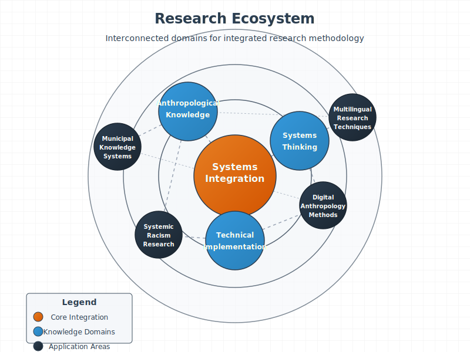

My research operates as an interconnected system that integrates multiple knowledge domains to create innovative methodologies. This systemic approach, inspired by Gregory Bateson's work, enables comprehensive analysis of complex social phenomena through multiple complementary perspectives.

## System Diagram

## Knowledge Domains

### Social Research Methodologies
- Qualitative data collection techniques
- Mixed-methods research design
- Cultural analysis frameworks
- Ethnographic approaches
- Interview and survey methodology

### Systems Thinking
- Bateson's levels of learning and cybernetic principles
- Pattern recognition across complex datasets
- Feedback loops and dynamic system modeling
- Emergent properties analysis
- Cross-domain pattern identification

### Technical Implementation
- Python-based data processing pipelines
- Natural language processing and computational linguistics
- Machine learning for qualitative data analysis
- RESTful API development
- Interactive data visualization techniques
- Multilingual and cross-cultural data processing

## Applications

This integrated approach creates practical applications in:

- **Municipal Knowledge Systems** - Analyzing institutional information flows and decision-making processes
- **Public Data Analysis** - Identifying patterns across consultation documents and public records
- **Digital Research Methods** - Developing new computational approaches for qualitative data analysis
- **Multilingual Content Analysis** - Processing and analyzing content across linguistic boundaries
- **Cross-cultural Data Science** - Implementing culturally-aware computational methods